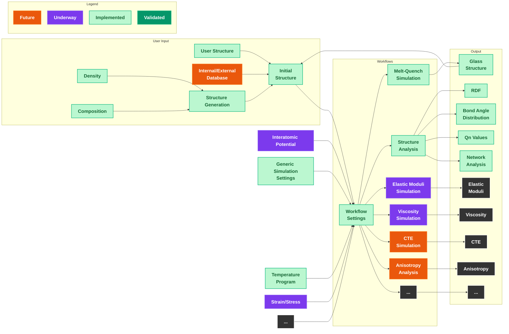

# amorphouspy

This project provides workflows to perform atomistic simulations for glasses.
This concerns, but is not limited to, generating initial structural models, performing melt-quenching simulations as well as analysing relevant properties. 

Later, these workflows serve as blueprints intended to be used by "Otto", the GlasAgent. 

## Contents

- `amorphouspy`: Workflows for atomistic modeling of oxide glasses
- `notebooks`: Jupyter notebooks for atomistic modeling of oxide glasses	

## Installation

```
conda env create -f environment.yml
conda activate amorphouspy
pip install -e amorphouspy
jupyter notebook notebooks/Meltquench.ipynb
```

## Developer setup
In addition, install
```
pip install -r amorphouspy/requirements-dev.txt
pre-commit install
```


## Upcoming milestones

- MS12 (end of 2025): Integration of existing GlasDigital workflows (DFT and classical MD) for determining density and elastic moduli
- MS12 (end of 2025): Workflows (classical MD) to determine high-temperature viscosity (TODO) and generation of structural models via melt-quenching (DONE)

----------------------------------------------------------

- MS42 (end of June 2028): Feature generation for ML and semi-empirical models based on glass structure​

- MS42 (end of June 2028): State-of-the art MLIP available​ (Testing started)
- MS42 (end of June 2028): Workflows for complex property analyses​. 
  - Qn values (DONE/TODO)
  - RDFs (DONE/TODO)
  - Network analysis (DONE/TODO)
  - Anisotropy analysis (TODO)
- MS60 (end of 2030): Demonstrator ready​

## Material systems to start with (proposed by Leopold (@ltalirz))

First, as an easy start we can work with crystalline materials that also exist as glasses:
1. NaAlSi3​O8​ (Albite)
2. CaAl2​Si2​O8​ (Anorthite)
3. CaB2​Si2​O8​ (Danburite)
4. (Mg,Fe)2​Al4​Si5​O18​ (Cordierite; NB: Achraf mentioned that Fe might be tricky due to different charge states)

Later, more complicated glasses from Schott can be considered. The following are only the approximate compositions, taken from the internet:

5. DGG3:
   - SiO2​ (~78.56%)
   - B2​O3​ (~12.7%)
   - Al2O3 (~2.76%)
   - Na2​O (~3.43%)
   - K2O (~0.94%)

6. FIOLAX clear:
   - SiO2​ (~75%)
   - B2​O3​ (~10.5%)
   - Na2​O (~7%)
   - Al2​O3​ (~5%)
   - CaO (~1.5%)

# Approximate amorphouspy workflow diagram 

