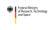
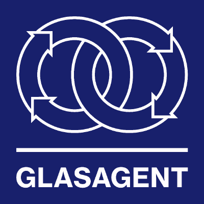

# amorphouspy

[](https://pypi.org/project/amorphouspy/)
[](https://glasagent.github.io/amorphouspy/)
[](https://codecov.io/gh/glasagent/amorphouspy)
[](https://doi.org/10.5281/zenodo.19553302)

<p align="center">
  <picture>
    <source media="(prefers-color-scheme: dark)" srcset="docs/assets/logo_inverted.png">
    
  </picture>
</p>

<!--content-start-->

> [!WARNING]
> This project is under active development and is **not yet ready for production use**. APIs and functionality may change without notice. Contributions and feedback are very welcome — feel free to [open an issue](https://github.com/glasagent/amorphouspy/issues) or submit a pull request!

A Python package for atomistic simulations of glasses.

`amorphouspy` provides capabilities in the form of Python functions from generating initial structural models through running molecular dynamics simulations with LAMMPS, all the way to computing material properties and performing detailed structural analysis.

`amorphouspy_api` strings these Python functions together to end-to-end workflows using `executorlib`. It then exposes these workflows through web endpoints, which can e.g. be used by an agent powered by a large language model.

Find the documentation at **[glasagent.github.io/amorphouspy](https://glasagent.github.io/amorphouspy)**.

## Key Features

`amorphouspy`

- **Structure Generation**: Create random oxide glass structures from composition dicts (e.g. `{"SiO2": 75, "Na2O": 15, "CaO": 10}`) with automatic density estimation using Fluegel's empirical model.
- **Interatomic Potentials**: Built-in support for PMMCS (Pedone), BJP (Bouhadja), and SHIK (Sundararaman) classical force fields with automatic LAMMPS input generation. Support for machine-learning interatomic potentials will come later.
- **Melt-Quench Simulations**: Multi-stage heating/cooling protocols with potential-specific temperature programs and ensemble control.
- **Structural Analysis**: RDFs, coordination numbers, Qn distributions, bond angle distributions, ring statistics, cavity analysis.
- **Property Calculations**: Elastic moduli (stress-strain finite differences), viscosity (Green-Kubo formalism), coefficient of thermal expansion (NPT fluctuations).

`amorphouspy_api`

- **End-to-end Workflows**: Submit a composition, get back the glass structure and all of its predicted properties
- **Job management API**: Fully fledged job management API, including results database
- **Visualization**: Interactive Plotly-based visualizations of glass structure and properties


## Installation

Install the bleeding edge version via
```bash
# Install pixi (if not already installed)
curl -fsSL https://pixi.sh/install.sh | bash

# Clone repo and install environment from PyPI/conda-forge
git clone https://github.com/glasagent/amorphouspy.git
cd amorphouspy
pixi install
```

You can also install the `amorphouspy` package into existing environments from PyPI or conda-forge,
see the [Installation guide](https://glasagent.github.io/amorphouspy/how_to_guides/installation) for details.

## Quick Start

See the [Tutorial](https://glasagent.github.io/amorphouspy/tutorial) for a step-by-step introduction.


## Authors

Developed at the [Bundesanstant für Materialforschung und -prüfung (BAM)](https://www.bam.de/Navigation/EN) in collaboration with [SCHOTT AG](https://www.schott.com/) and the [Max Planck Institute for Sustainable Materials](https://www.mpie.de/en).

- **Achraf Atila** — BAM — Core framework, analysis tools, potentials
- **Marcel Sadowski** — Schott AG — CTE simulation module
- **Jan Janssen** — MPI-SusMat — pyiron integration, lammpsparser
- **Leopold Talirz** — Schott AG — API layer, project coordination

## Acknowledgement

Supported by the [Federal Ministry of Research, Technology and Space](https://www.bmftr.bund.de/EN) via the [GlasAgent MaterialDigital 3 project](https://www.materialdigital.de/project/28).

<p align="center">
  <a href="https://www.bmbf.de/"></a>
  &emsp;&emsp;&emsp;
  <a href="https://www.materialdigital.de/"></a>
  &emsp;&emsp;&emsp;
  <a href="https://www.materialdigital.de/project/28"></a>
</p>

## How to Cite

If you use `amorphouspy` in your research, please cite it using the citation information provided on our [Zenodo record](https://doi.org/10.5281/zenodo.19553302) (see the "Citation" box on the right-hand side).

## License

Apache License 2.0. See [LICENSE](LICENSE).

<!--content-end-->
