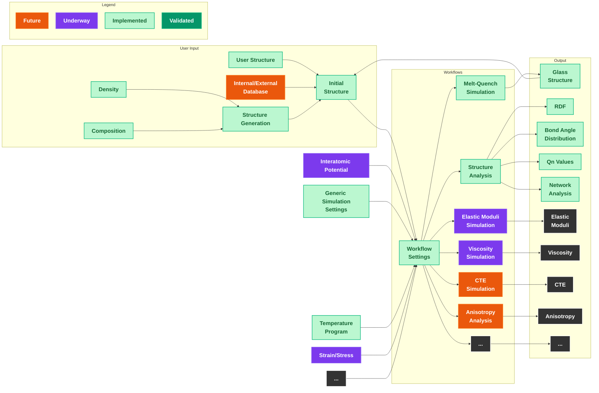

# Architecture

For more information on the internal workings, this section provides an overview of how `amorphouspy` is organized internally.

## Workflow Overview

The following diagram shows the full simulation pipeline, from user input through workflows to output properties:



## Package Organization

```
amorphouspy/
├── structure.py          # Composition parsing, structure generation, density model
├── mass.py               # Atomic mass utilities (wraps ASE data)
├── neighbors.py          # Cell-list neighbor search with periodic boundary conditions
├── io_utils.py           # LAMMPS I/O, XYZ writer, ASE Atoms helpers
├── shared.py             # Element type mapping, distribution counting utilities
├── potentials/
│   ├── potential.py      # Unified potential generator interface
│   ├── pmmcs_potential.py  # Pedone (PMMCS) Morse + Coulomb
│   ├── bjp_potential.py    # Bouhadja Born-Mayer-Huggins + Coulomb
│   └── shik_potential.py   # SHIK Buckingham + r⁻²⁴ + Coulomb
├── analysis/
│   ├── radial_distribution_functions.py  # RDF g(r) and coordination n(r)
│   ├── qn_network_connectivity.py        # Qⁿ distribution and network connectivity
│   ├── bond_angle_distribution.py        # O-X-O and X-O-X bond angle histograms
│   ├── rings.py                          # Guttman ring statistics (via sovapy)
│   ├── cavities.py                       # Void/cavity volume analysis (via sovapy)
│   └── cte.py                            # CTE from NPT fluctuations
└── workflows/
    ├── meltquench.py           # Core melt-quench simulation logic
    ├── meltquench_protocols.py # Potential-specific multi-stage protocols
    ├── md.py                   # Single-point NVT/NPT molecular dynamics
    ├── elastic_mod.py          # Elastic moduli via stress-strain finite differences
    ├── viscosity.py            # Viscosity via Green-Kubo (SACF integration)
    ├── cte.py                  # CTE simulation with convergence checking
    ├── structural_analysis.py  # Comprehensive analysis pipeline + Plotly plotting
    └── shared.py               # LAMMPS command builder utility
```
