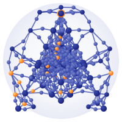
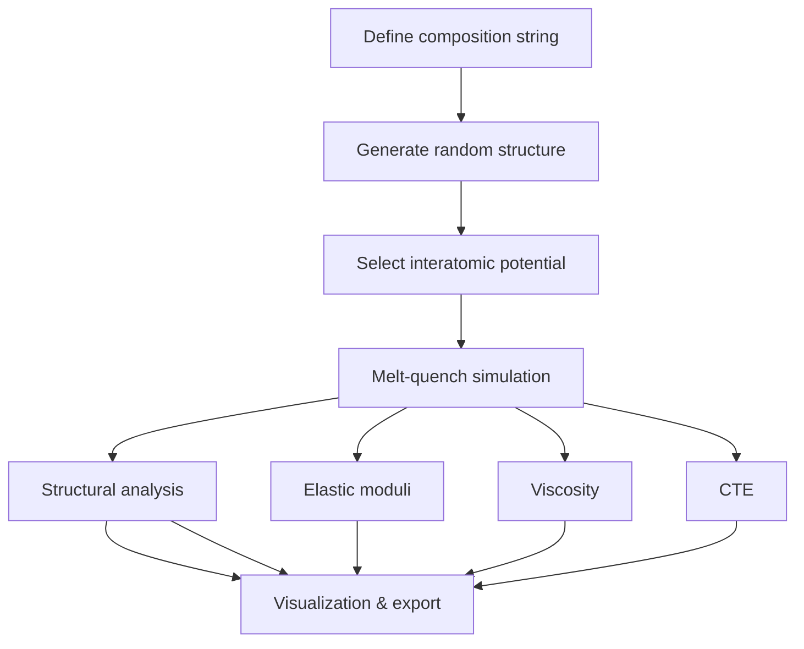

# Welcome to amorphouspy

## Introduction

`amorphouspy` is a Python framework for computational glass science. It provides end-to-end workflows that span from generating initial structural models through running molecular dynamics simulations with LAMMPS, all the way to computing material properties and performing detailed structural analysis.

The package was developed at the [Bundesanstalt für Materialforschung und -prüfung (BAM)](https://www.bam.de/) in collaboration with [Schott AG](https://www.schott.com/) and the [Max-Planck-Institut für Eisenforschung (MPIE)](https://www.mpie.de/).

## Key Features

- **Structure Generation**: Create random oxide glass structures from composition strings with automatic density estimation using Fluegel's empirical model.
- **Interatomic Potentials**: Built-in support for PMMCS (Pedone), BJP (Bouhadja), and SHIK (Sundararaman) classical force fields with automatic LAMMPS input generation.
- **Melt-Quench Simulations**: Multi-stage heating/cooling protocols with potential-specific temperature programs and ensemble control.
- **Structural Analysis**: RDFs, coordination numbers, $Q^n$ distributions, bond angle distributions, ring statistics, cavity analysis.
- **Property Calculations**: Elastic moduli (stress-strain finite differences), viscosity (Green-Kubo formalism), coefficient of thermal expansion (NPT fluctuations).
- **Visualization**: Interactive Plotly-based plotting of all structural analysis results.

### Typical Workflow

The standard workflow for studying oxide glasses with `amorphouspy` follows this pipeline:

Each step is handled by dedicated functions in the package, and the output of one step feeds naturally into the next.

## Authors

- **Achraf Atila** — BAM (achraf.atila@bam.de) — Core framework, analysis tools, potentials
- **Marcel Sadowski** — Schott AG — CTE simulation module
- **Jan Janssen** — MPIE — pyiron integration, lammpsparser
- **Leopold Talirz** — Schott AG — API layer, project coordination

## License

BSD 3-Clause License. See [LICENSE](../LICENSE).
