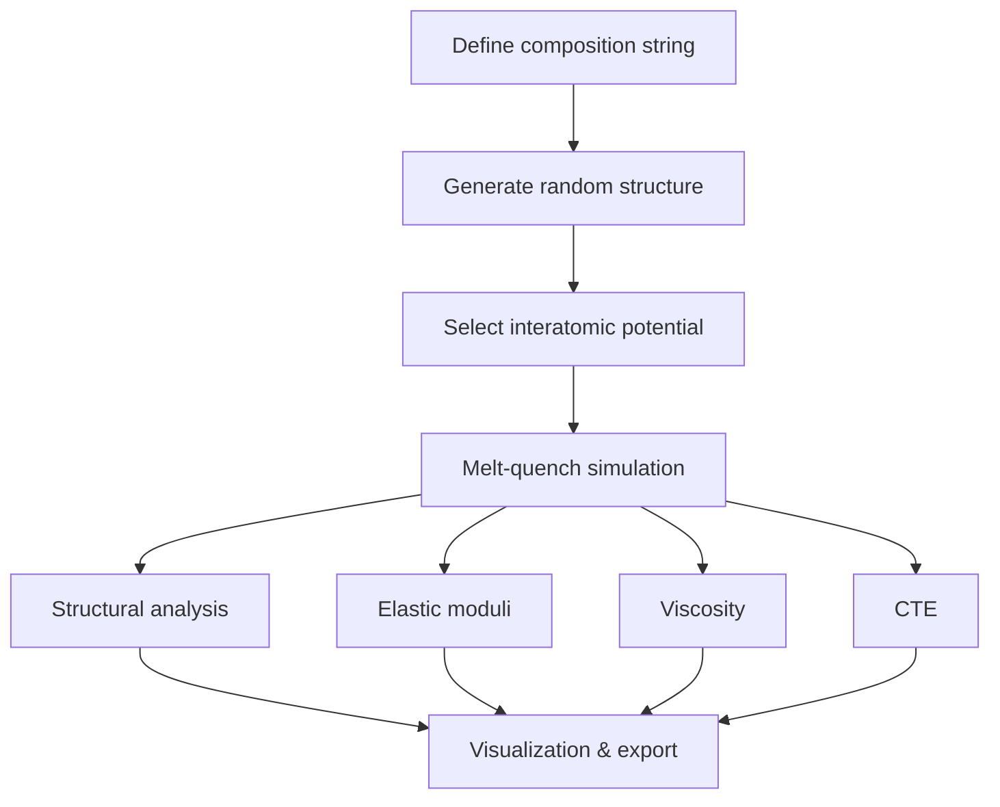

# amorphouspy

**Workflows for atomistic modeling of oxide glasses.**

`amorphouspy` is a Python framework for computational glass science. It provides end-to-end workflows that span from generating initial structural models through running molecular dynamics simulations with LAMMPS, all the way to computing material properties and performing detailed structural analysis.

The package was developed at the [Bundesanstalt für Materialforschung und -prüfung (BAM)](https://www.bam.de/) in collaboration with [Schott AG](https://www.schott.com/) and the [Max-Planck-Institut für Eisenforschung (MPIE)](https://www.mpie.de/).

---

## Key Features

| Capability | Description |
|---|---|
| **Structure Generation** | Create random oxide glass structures from composition strings with automatic density estimation using Fluegel's empirical model |
| **Interatomic Potentials** | Built-in support for PMMCS (Pedone), BJP (Bouhadja), and SHIK (Sundararaman) classical force fields with automatic LAMMPS input generation |
| **Melt-Quench Simulations** | Multi-stage heating/cooling protocols with potential-specific temperature programs and ensemble control |
| **Structural Analysis** | RDFs, coordination numbers, $Q^n$ distributions, bond angle distributions, ring statistics, cavity analysis |
| **Property Calculations** | Elastic moduli (stress-strain finite differences), viscosity (Green-Kubo formalism), coefficient of thermal expansion (NPT fluctuations) |
| **Visualization** | Interactive Plotly-based plotting of all structural analysis results |

---

## Installation

### Using conda (recommended)

The recommended approach uses conda to install LAMMPS and all dependencies, then pip to install the package itself:

```bash
# Clone the repository
git clone https://github.com/glasagent/amorphouspy.git
cd amorphouspy

# Create and activate the conda environment
conda env create -f environment.yml
conda activate amorphouspy

# Install the core library in editable mode
pip install -e amorphouspy
```

> **Note:** The conda environment installs LAMMPS with OpenMPI support (`lammps =2024.08.29=*_openmpi_*`), which provides the `lmp_mpi` executable required by all simulation workflows.

### Using pip only (analysis-only)

If you only need the analysis and structure generation tools (no LAMMPS simulations):

```bash
pip install amorphouspy
```

> **Warning:** Without a LAMMPS installation, the simulation workflows (`melt_quench_simulation`, `md_simulation`, `elastic_simulation`, etc.) will not work. Only structure generation and analysis functions will be available.

### Dependencies

Core dependencies installed automatically:

| Package | Purpose |
|---|---|
| [ASE](https://wiki.fysik.dtu.dk/ase/) (≥3.25) | Atomic Simulation Environment — structure representation and I/O |
| [lammpsparser](https://github.com/pyiron/lammpsparser) (0.0.1) | LAMMPS file interface — reads/writes LAMMPS input and dump files |
| [numba](https://numba.pydata.org/) | JIT compilation for performance-critical neighbor search and RDF calculations |
| [pymatgen](https://pymatgen.org/) (2025.10) | Charge neutrality validation for oxide compositions |
| [sovapy](https://github.com/MotokiShiga/sova-cui) (0.8.3) | Ring analysis (Guttman algorithm) and cavity/void detection |
| [scipy](https://scipy.org/) (1.16) | Curve fitting (VFT model), signal processing (Savitzky-Golay smoothing) |
| [pandas](https://pandas.pydata.org/) (2.3) | Potential configuration DataFrames |
| [numpy](https://numpy.org/) (2.3) | Core numerical computing |

System requirements:

| Requirement | Details |
|---|---|
| **Python** | ≥ 3.9 (developed with 3.13) |
| **LAMMPS** | Available as `lmp_mpi` on PATH (for simulation workflows) |
| **MPI** | OpenMPI recommended (for parallel LAMMPS) |

### Developer setup

```bash
pip install -r amorphouspy/requirements-dev.txt
pre-commit install
```

---

## Quick Start

### 1. Generate a glass structure

The first step in any simulation is creating an initial atomic configuration. `amorphouspy` takes a composition string and generates random atom positions in a periodic cubic box with the correct stoichiometry and a physically realistic density.

```python
from amorphouspy import get_structure_dict, get_ase_structure

# Define a soda-lime silicate composition (molar fractions)
composition = "0.75SiO2-0.15Na2O-0.10CaO"

# Generate structure with ~3000 atoms
# Density is auto-calculated using Fluegel's empirical model
structure_dict = get_structure_dict(composition, target_atoms=3000)

# Convert to ASE Atoms object for visualization and manipulation
atoms = get_ase_structure(structure_dict)

print(f"Generated {len(atoms)} atoms in a {structure_dict['box']:.2f} Å box")
print(f"Formula units: {structure_dict['formula_units']}")
print(f"Element counts: {structure_dict['element_counts']}")
```

### 2. Set up an interatomic potential

Choose from three built-in classical force fields. The potential generator returns a DataFrame containing all LAMMPS configuration lines:

```python
from amorphouspy import generate_potential

# Generate PMMCS potential (broadest element coverage)
potential = generate_potential(structure_dict, potential_type="pmmcs")

# Other options:
# potential = generate_potential(structure_dict, potential_type="bjp")   # CAS glasses
# potential = generate_potential(structure_dict, potential_type="shik")  # Si/Al/B glasses
```

### 3. Run a melt-quench simulation

Transform the random initial structure into a realistic amorphous glass through a heating-equilibration-cooling cycle:

```python
from amorphouspy import melt_quench_simulation

result = melt_quench_simulation(
    structure=atoms,
    potential=potential,
    temperature_high=5000.0,   # Melt at 5000 K
    temperature_low=300.0,     # Quench to 300 K
    heating_rate=1e12,         # K/s (typical for MD)
    cooling_rate=1e12,         # K/s
)

glass_structure = result["structure"]  # Quenched glass
```

> **Tip:** For production runs, use the potential-specific protocols which include optimized multi-stage temperature programs. See [Simulation Workflows](workflows.md) for details.

### 4. Analyze the glass structure

Run a comprehensive structural analysis with a single function call:

```python
from amorphouspy import analyze_structure
from amorphouspy.workflows.structural_analysis import plot_analysis_results_plotly

# Compute all structural properties
data = analyze_structure(glass_structure)

# Inspect results
print(f"Density: {data.density:.3f} g/cm³")
print(f"Network connectivity: {data.network.connectivity:.2f}")
print(f"Qⁿ distribution: {data.network.Qn_distribution}")
print(f"Si coordination: {data.coordination.formers}")

# Generate interactive Plotly visualization
fig = plot_analysis_results_plotly(data)
fig.show()
```

### 5. Compute material properties

```python
from amorphouspy import elastic_simulation

# Calculate elastic constants via stress-strain method
elastic_result = elastic_simulation(
    structure=glass_structure,
    potential=potential,
    temperature=300.0,
    strain=1e-3,
    production_steps=10_000,
)

print(f"Young's modulus: {elastic_result['E']:.1f} GPa")
print(f"Bulk modulus: {elastic_result['B']:.1f} GPa")
print(f"Poisson's ratio: {elastic_result['nu']:.3f}")
```

---

## Typical Workflow

The standard workflow for studying oxide glasses with `amorphouspy` follows this pipeline:



Each step is handled by dedicated functions in the package, and the output of one step feeds naturally into the next.

---

## Package Organization

```
amorphouspy/
├── structure.py          # Composition parsing, structure generation, density model
├── mass.py               # Atomic mass utilities (wraps ASE data)
├── neighbors.py          # Cell-list neighbor search with periodic boundary conditions
├── io_utils.py           # LAMMPS I/O, XYZ writer, ASE Atoms helpers
├── shared.py             # Element type mapping, distribution counting utilities
├── potentials/
│   ├── potential.py      # Unified potential generator interface
│   ├── pmmcs_potential.py  # Pedone (PMMCS) Morse + Coulomb
│   ├── bjp_potential.py    # Bouhadja Born-Mayer-Huggins + Coulomb
│   └── shik_potential.py   # SHIK Buckingham + r⁻²⁴ + Coulomb
├── analysis/
│   ├── radial_distribution_functions.py  # RDF g(r) and coordination n(r)
│   ├── qn_network_connectivity.py        # Qⁿ distribution and network connectivity
│   ├── bond_angle_distribution.py        # O-X-O and X-O-X bond angle histograms
│   ├── rings.py                          # Guttman ring statistics (via sovapy)
│   ├── cavities.py                       # Void/cavity volume analysis (via sovapy)
│   └── cte.py                            # CTE from NPT fluctuations
└── workflows/
    ├── meltquench.py           # Core melt-quench simulation logic
    ├── meltquench_protocols.py # Potential-specific multi-stage protocols
    ├── md.py                   # Single-point NVT/NPT molecular dynamics
    ├── elastic_mod.py          # Elastic moduli via stress-strain finite differences
    ├── viscosity.py            # Viscosity via Green-Kubo (SACF integration)
    ├── cte.py                  # CTE simulation with convergence checking
    ├── structural_analysis.py  # Comprehensive analysis pipeline + Plotly plotting
    └── shared.py               # LAMMPS command builder utility
```

---

## Documentation

| Guide | Contents |
|---|---|
| [Structure Generation](structure.md) | Composition strings, density estimation, random atom placement, system planning |
| [Interatomic Potentials](potentials.md) | PMMCS, BJP, and SHIK force field setup, functional forms, supported elements |
| [Simulation Workflows](workflows.md) | Melt-quench, MD, elastic, viscosity, CTE — parameters, protocols, and outputs |
| [Structural Analysis](analysis.md) | RDF, coordination, $Q^n$, bond angles, rings, cavities — theory and usage |
| [API Reference](api_reference.md) | Complete function signatures with all parameters and return types |

---

## Example Notebooks

The `notebooks/` directory contains runnable Jupyter notebooks demonstrating complete workflows:

| Notebook | Description |
|---|---|
| `Meltquench.ipynb` | Full melt-quench workflow from composition to glass structure |
| `Meltquench_PMMCS.ipynb` | Melt-quench using the PMMCS (Pedone) potential |
| `Meltquench_BJP.ipynb` | Melt-quench using the BJP (Bouhadja) potential for CAS glasses |
| `Meltquench_SHIK.ipynb` | Melt-quench using the SHIK (Sundararaman) potential |
| `StructureAnalysis.ipynb` | Comprehensive structural analysis with visualization |
| `ElasticProperties.ipynb` | Elastic moduli calculation via stress-strain method |
| `Viscosity.ipynb` | Viscosity calculation via Green-Kubo formalism |
| `CTE.ipynb` | Coefficient of thermal expansion from NPT simulations |
| `meltquench_Structure_analysis.ipynb` | Combined melt-quench + analysis pipeline |

---

## Authors

- **Achraf Atila** — BAM (achraf.atila@bam.de) — Core framework, analysis tools, potentials
- **Marcel Sadowski** — Schott AG — CTE simulation module
- **Jan Janssen** — MPIE — pyiron integration, lammpsparser
- **Leopold Talirz** — Schott AG — API layer, project coordination

## License

BSD 3-Clause License. See [LICENSE](../LICENSE).
