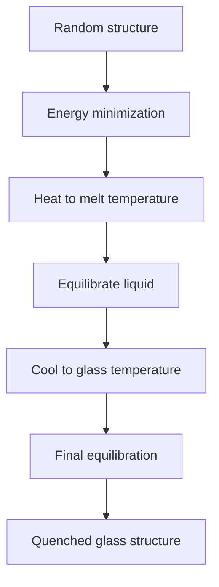

# Melt-Quench Simulation

The melt-quench workflow transforms a random initial atomic configuration into a realistic amorphous glass structure by simulating the glass formation process: melting at high temperature, equilibrating the liquid, and rapidly cooling (quenching) to below the glass transition temperature.

---

## Process Overview



### Stages

1. **Energy minimization** — Relax the random initial configuration to remove atomic overlaps
2. **Heating** — Ramp temperature from low to the melting temperature (typically 3000–6000 K)
3. **Melt equilibration** — Hold at high temperature to equilibrate the liquid (lose memory of initial config)
4. **Cooling** — Ramp temperature down to the target glass temperature (typically 300 K)
5. **Final equilibration** — Hold at the target temperature to equilibrate the glass

---

## Basic Usage

### `melt_quench_simulation(structure, potential, ...)`

```python
from amorphouspy import melt_quench_simulation

result = melt_quench_simulation(
    structure=atoms,
    potential=potential,
    temperature_high=5000.0,  # Melt temperature (K)
    temperature_low=300.0,    # Quench target (K)
    heating_rate=1e12,        # K/s
    cooling_rate=1e12,        # K/s
    timestep=1.0,             # fs
    # equilibration_steps=10_000,  # Override fixed stages (None → protocol defaults)
)

glass = result["structure"]     # Quenched ASE Atoms
```

**Parameters:**

| Parameter | Type | Default | Description |
|---|---|---|---|
| `structure` | `Atoms` | — | Initial structure (from `get_ase_structure()`) |
| `potential` | `DataFrame` | — | Potential configuration (from `generate_potential()`) |
| `temperature_high` | `float` | — | Maximum (melting) temperature in K |
| `temperature_low` | `float` | — | Final (glass) temperature in K |
| `heating_rate` | `float` | `1e12` | Heating rate in K/s |
| `cooling_rate` | `float` | `1e12` | Cooling rate in K/s |
| `equilibration_steps` | `int \| None` | `None` | Override for all fixed equilibration stages inside the protocol. If `None`, each protocol uses its own production defaults. |
| `timestep` | `float` | `1.0` | MD timestep in femtoseconds |

**Returns:** A dictionary with:

| Key | Type | Description |
|---|---|---|
| `"structure"` | `Atoms` | Final quenched glass structure |
| `"trajectory"` | `list[Atoms]` | Structures at each stage |
| `"thermo"` | `dict` | Thermodynamic data (T, P, E, V vs. step) |

---

## Potential-Specific Protocols

Each interatomic potential has an optimized multi-stage protocol that has been validated to produce high-quality glass structures.

### `melt_quench_protocol(structure, potential, potential_type, ...)`

```python
from amorphouspy import melt_quench_protocol

# Automatically selects the right protocol for the potential
result = melt_quench_protocol(
    structure=atoms,
    potential=potential,
    potential_type="pmmcs",  # or "bjp" or "shik"
)
```

### PMMCS Protocol

Multi-stage NPT protocol with long equilibration holds:

| Stage | Temperature range | Ensemble | Duration |
|---|---|---|---|
| 1. Heat | T_low → T_high | NVT | Variable (heating rate) |
| 2. Equilibrate | T_high | NVT | 1,000,000 steps |
| 3. Cool | T_high → T_low | NVT | Variable (cooling rate) |
| 4. Pressure release | T_low | NPT (P=0) | 1,000,000 steps |
| 5. Final equilibration | T_low | NVT | 100,000 steps |

### BJP Protocol

NPT protocol optimised for CAS glasses with pressure control throughout:

| Stage | Temperature range | Ensemble | Duration |
|---|---|---|---|
| 1. Heat | T_low → T_high | NPT (P=0) | Variable (heating rate) |
| 2. Equilibrate | T_high | NPT (P=0) | 100,000 steps |
| 3. Cool | T_high → T_low | NPT (P=0) | Variable (cooling rate) |
| 4. Pressure release | T_low | NPT (P=0) | 100,000 steps |
| 5. Final equilibration | T_low | NVT | 100,000 steps |

### SHIK Protocol

Includes a Langevin pre-equilibration stage and a pressure ramp during cooling to handle the steep $r^{-24}$ repulsion:

| Stage | Temperature range | Ensemble | Duration |
|---|---|---|---|
| 1. Heat | T_high | NVT (Langevin) | Variable (heating rate) |
| 2. NVT equilibration | T_high | NVT | 100,000 / timestep steps (~100 ps) |
| 3. NPT equilibration | T_high | NPT (P=0.1 GPa) | 700,000 / timestep steps (~700 ps) |
| 4. Cool | T_high → T_low | NPT (P=0.1→0 GPa) | Variable (cooling rate) |
| 5. Anneal | T_low | NPT (P=0) | 100,000 / timestep steps (~100 ps) |

The pressure ramp in stage 4 (`iso 0.1 → 0.0 GPa`) helps the system densify correctly during cooling.

> **Override:** Pass `equilibration_steps=N` to `melt_quench_simulation` (or the API's `simulation.equilibration_steps`) to replace all fixed-duration stages with `N` steps. This is useful for fast CI tests or exploratory runs without changing production defaults.

---

## Cooling Rate Effects

The cooling rate is a critical parameter in MD glass simulations:

| Cooling rate (K/s) | MD equivalent | Notes |
|---|---|---|
| $10^{14}$ | Very fast | Highest fictive T, lowest density |
| $10^{13}$ | Fast | Standard rapid quench |
| $10^{12}$ | Moderate | Better structures, longer computation |
| $10^{11}$ | Slow | Closer to experimental, very expensive |
| $10^{0}$ (experiment) | Not accessible | MD cannot reach experimental rates |

> **Tip:** For production studies, use cooling rates of $10^{12}$–$10^{13}$ K/s. Slower rates give more realistic structures but the computational cost scales linearly. Generate multiple independent samples to assess statistical uncertainty.

---

## Tips

- **System size**: 3000–10,000 atoms is adequate for most structural properties. Use larger systems (~100,000 atoms) for ring statistics and long-range correlations.
- **Multiple samples**: Generate 3–5 independent glasses per composition using different random seeds for statistical averaging.
- **Density validation**: Compare the final glass density to the Fluegel model prediction or experimental values.
- **Structure inspection**: Always visualize the quenched structure (e.g., with ASE's `view()`) to catch obvious issues like phase separation or incomplete mixing.
