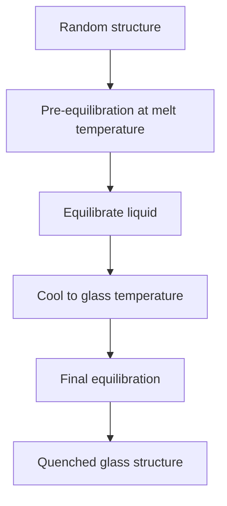

# Melt-Quench Simulation

The melt-quench workflow transforms a random initial atomic configuration into a realistic amorphous glass structure by simulating the glass formation process: melting at high temperature, equilibrating the liquid, and rapidly cooling (quenching) to below the glass transition temperature.

---

## Process Overview


```mermaid
graph TD
    A[Random structure] --> B[Pre-equilibration at melt temperature]
    B --> C[Equilibrate liquid]
    C --> D[Cool to glass temperature]
    D --> E[Final equilibration]
    E --> F[Quenched glass structure]
```

### Stages

1. **Pre-equilibration (stage 0)** — Langevin + `nve/limit` run at the melt temperature that removes atomic overlaps in the random configuration (optional; `pre_equilibrate=True` by default)
2. **Melt equilibration** — Equilibrate the liquid directly at the melt temperature (typically 3000–6000 K); there is no heating ramp
3. **Cooling** — Ramp temperature down to the target glass temperature (typically 300 K)
4. **Final equilibration** — Pressure release / anneal at the target temperature

---

## Basic Usage

### `melt_quench_simulation(structure, potential, ...)`

```python
from amorphouspy import melt_quench_simulation

result = melt_quench_simulation(
    structure=atoms,
    potential=potential,
    temperature_high=5000.0,  # Melt temperature (K)
    temperature_low=300.0,    # Quench target (K)
    cooling_rate=1e12,        # K/s
    timestep=1.0,             # fs
    # equilibration_steps=10_000,  # Override fixed stages (None → protocol defaults)
)

glass = result["structure"]     # Quenched ASE Atoms
```

**Parameters:**

| Parameter | Type | Default | Description |
|---|---|---|---|
| `structure` | `Atoms` | — | Initial structure (from `get_ase_structure()`) |
| `potential` | `DataFrame` | — | Potential configuration (from `generate_potential()`) |
| `temperature_high` | `float` | — | Maximum (melting) temperature in K |
| `temperature_low` | `float` | — | Final (glass) temperature in K |
| `cooling_rate` | `float` | `1e12` | Cooling rate in K/s |
| `equilibration_steps` | `int \| None` | `None` | Override for all fixed equilibration stages inside the protocol. If `None`, each protocol uses its own production defaults. |
| `timestep` | `float` | `1.0` | MD timestep in femtoseconds |
| `pre_equilibrate` | `bool` | `True` | Run the 10,000-step Langevin + `nve/limit` stage 0 at `temperature_high`. Needed for randomly placed structures; set `False` when the starting structure is already equilibrated (its history entry is then `None`). |

**Returns:** A dictionary with:

| Key | Type | Description |
|---|---|---|
| `"structure"` | `Atoms` | Final quenched glass structure |
| `"result"` | `list` | Thermodynamic history across all stages |

---

## Potential-Specific Protocols

Each interatomic potential has an optimized multi-stage protocol that has been validated to produce high-quality glass structures.

The potential-specific protocol is selected automatically by `melt_quench_simulation` based on the potential name. Pass the potential DataFrame and the correct protocol runs:

```python
from amorphouspy import melt_quench_simulation

result = melt_quench_simulation(
    structure=atoms,
    potential=potential,  # potential name determines the protocol (pmmcs, bjp, shik, bmp-*)
)
```

### PMMCS Protocol

NVT-based protocol with long equilibration holds. The Du/Teter protocol uses the same stage sequence (with a default melt temperature of 5000 K):

| Stage | Temperature range | Ensemble | Duration |
|---|---|---|---|
| 0. Pre-equilibration | T_high | Langevin + `nve/limit` | 10,000 steps (skipped when `pre_equilibrate=False`) |
| 1. Melt equilibration | T_high | NVT | 1,000,000 steps |
| 2. Cool | T_high → T_low | NVT | Variable (cooling rate) |
| 3. Pressure release | T_low | NPT (P=0) | 1,000,000 steps |

### BJP Protocol

NPT protocol optimised for CAS glasses with pressure control throughout:

| Stage | Temperature range | Ensemble | Duration |
|---|---|---|---|
| 0. Pre-equilibration | T_high | Langevin + `nve/limit` | 10,000 steps (skipped when `pre_equilibrate=False`) |
| 1. Melt equilibration | T_high | NPT (P=0) | 100,000 steps |
| 2. Cool | T_high → T_low | NPT (P=0) | Variable (cooling rate) |
| 3. Pressure release | T_low | NPT (P=0) | 100,000 steps |

### BMP Protocol

NVT-based protocol for multi-component glasses with explicit three-body interactions. Applies to both `bmp-harmonic` and `bmp-screened-harmonic` — the variants differ only in their potential parameters, not in the MD protocol.

| Stage | Temperature range | Ensemble | Duration |
|---|---|---|---|
| 0. Pre-equilibration | T_high | Langevin + `nve/limit` | 10,000 steps (skipped when `pre_equilibrate=False`) |
| 1. Melt equilibration | T_high | NVT | 1,000,000 steps |
| 2. Cool | T_high → T_low | NVT | Variable (cooling rate) |
| 3. Pressure release | T_low | NPT (P=0) | 1,000,000 steps |

The default melt temperature for BMP is **4000 K**. All stages run in NVT or NPT — no pressure ramp is required because the Morse + Buckingham form is less steep than the SHIK $r^{-24}$ term.

### SHIK Protocol

Adds an NPT hold at 0.1 GPa and a pressure ramp during cooling to handle the steep $r^{-24}$ repulsion:

| Stage | Temperature range | Ensemble | Duration |
|---|---|---|---|
| 0. Pre-equilibration | T_high | Langevin + `nve/limit` | 10,000 steps (skipped when `pre_equilibrate=False`) |
| 1. Melt equilibration | T_high | NVT | 100,000 / timestep steps (~100 ps) |
| 2. NPT equilibration | T_high | NPT (P=0.1 GPa) | 700,000 / timestep steps (~700 ps) |
| 3. Cool | T_high → T_low | NPT (P=0.1→0 GPa) | Variable (cooling rate) |
| 4. Anneal | T_low | NPT (P=0) | 100,000 / timestep steps (~100 ps) |

The pressure ramp in stage 3 (`iso 0.1 → 0.0 GPa`) helps the system densify correctly during cooling, following the published SHIK melt-quench recipe.

### Yang2026 Protocol

NPT-based protocol from Yang et al., *J. Non-Cryst. Solids* **684**, 124104 (2026), with a high-pressure densification hold:

| Stage | Temperature range | Ensemble | Duration |
|---|---|---|---|
| 0. Pre-equilibration | T_high | Langevin + `nve/limit` | 10,000 steps (skipped when `pre_equilibrate=False`) |
| 1. Equilibration | 300 K | NVT | ~20 ps |
| 2. Equilibration | 300 K | NPT (P=0) | ~20 ps |
| 3. High-pressure melt | T_high | NPT (P=20,000 atm) | ~100 ps |
| 4. Melt at ambient P | T_high | NPT (P=0) | ~100 ps |
| 5. Cool | T_high → 300 K | NPT (P=0) | Variable (cooling rate) |
| 6. Final equilibration | 300 K | NPT (P=0) | ~100 ps |

### Stage 0 and the returned history

No protocol has a heating ramp: stage 0 relaxes the random structure with a Langevin + `nve/limit` run at `temperature_high`, and the following stage equilibrates the liquid directly at the melt temperature. Stage 0 is its own protocol stage, so it appears as the first entry of the returned history; when skipped (`pre_equilibrate=False`), its entry is `None` so stage indices stay stable.

> **Override:** Pass `equilibration_steps=N` to `melt_quench_simulation` (or the API's `simulation.equilibration_steps`) to replace all fixed-duration stages with `N` steps. This is useful for fast CI tests or exploratory runs without changing production defaults.

---

## Cooling Rate Effects

The cooling rate is a critical parameter in MD glass simulations:

| Cooling rate (K/s) | MD equivalent | Notes |
|---|---|---|
| $10^{14}$ | Very fast | Highest fictive T, lowest density |
| $10^{13}$ | Fast | Standard rapid quench |
| $10^{12}$ | Moderate | Better structures, longer computation |
| $10^{11}$ | Slow | Closer to experimental, very expensive |
| $10^{0}$ (experiment) | Not accessible | MD cannot reach experimental rates |

> **Tip:** For production studies, use cooling rates of $10^{12}$–$10^{13}$ K/s. Slower rates give more realistic structures but the computational cost scales linearly. Generate multiple independent samples to assess statistical uncertainty.

---

## Tips

- **System size**: 3000–10,000 atoms is adequate for most structural properties. Use larger systems (~100,000 atoms) for ring statistics and long-range correlations.
- **Multiple samples**: Generate 3–5 independent glasses per composition using different random seeds for statistical averaging.
- **Density validation**: Compare the final glass density to the Fluegel model prediction or experimental values.
- **Structure inspection**: Always visualize the quenched structure (e.g., with ASE's `view()`) to catch obvious issues like phase separation or incomplete mixing.
