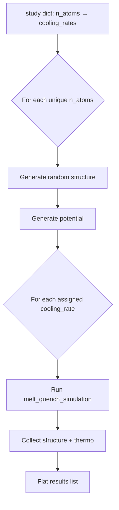

# Parametric Study

The parametric study workflow sweeps over **system size** (`n_atoms`) and **cooling rate** in a single call to identify converged simulation settings before committing to expensive production runs.

---

## Why a Parametric Study?

Two parameters dominate the cost and quality of a melt-quench glass simulation:

| Parameter | Effect on quality | Effect on cost |
|---|---|---|
| **System size** (`n_atoms`) | Larger boxes suppress finite-size artefacts in structural properties (RDF, coordination, ring statistics) | Scales as O(N log N) per step; larger boxes also need more steps to equilibrate |
| **Cooling rate** | Slower cooling → more relaxed glass, closer to experimental fictive temperature | Steps scale linearly with 1/rate |

The `study` dict lets you assign different cooling rates to each system size — run a full sweep on small systems to establish trends, then limit large expensive systems to only the rates that matter.

---

## Process Overview



Structures are cached per system size, so each unique system size is generated only once regardless of how many cooling rates are assigned to it.

---

## Basic Usage

### `parametric_melt_quench(composition, potential_type, study, ...)`

```python
from amorphouspy import parametric_melt_quench

results = parametric_melt_quench(
    composition={"SiO2": 70, "Na2O": 15, "CaO": 15},
    potential_type="pmmcs",
    study={
        300:  [1e11, 1e12, 1e13],   # small system — full rate sweep
        1000: [1e11, 1e12, 1e13],   # medium system — full rate sweep
        10000: [1e13],              # large system — production rate only
        100000: [1e13],             # large system — production rate only
    },
    temperature_high=5000.0,
    temperature_low=300.0,
    timestep=1.0,
    # equilibration_steps=5000,  # reduced for fast screening; remove for production
    seed=42,
)
```

**Parameters:**

| Parameter | Type | Default | Description |
|---|---|---|---|
| `composition` | `dict[str, float]` | — | Oxide mol% composition, e.g. `{"SiO2": 70, "Na2O": 15, "CaO": 15}` |
| `potential_type` | `str` | — | Potential name: `"pmmcs"`, `"bjp"`, or `"shik"` |
| `study` | `dict[int, list[float]]` | — | Mapping of target atom count to the cooling rates (K/s) to run for that size |
| `temperature_high` | `float | None` | `None` | Melt temperature in K. `None` uses the protocol default (5000 K for PMMCS/BJP, 4000 K for SHIK) |
| `temperature_low` | `float` | `300.0` | Final glass temperature in K |
| `timestep` | `float` | `1.0` | MD timestep in femtoseconds |
| `heating_rate` | `float | None` | `1e13` | Heating rate in K/s. `None` defers to the protocol default inside `melt_quench_simulation` |
| `n_print` | `int` | `1000` | Output frequency in simulation steps |
| `equilibration_steps` | `int | None` | `None` | Override for all fixed equilibration stages. `None` uses protocol defaults |
| `server_kwargs` | `dict | None` | `None` | LAMMPS server kwargs, e.g. `{"cores": 4}` |
| `seed` | `int` | `12345` | Random seed for velocity initialisation |
| `tmp_working_directory` | `str | Path | None` | `None` | Directory for LAMMPS temporary files |

**Returns:** Flat list of dicts in the order they appear in `study` (outer loop over sizes, inner loop over each size's cooling rates):

| Key | Type | Description |
|---|---|---|
| `"n_atoms"` | `int` | Actual atom count after integer formula-unit rounding |
| `"target_n_atoms"` | `int` | Requested target (may differ slightly) |
| `"cooling_rate"` | `float` | Cooling rate used (K/s) |
| `"heating_rate"` | `float` | Heating rate used (K/s) |
| `"structure"` | `Atoms` | Final quenched ASE `Atoms` object |
| `"result"` | `list[dict | None]` | Per-stage thermodynamic history from `melt_quench_simulation` |

---

## Convergence Analysis

### System-size convergence

Plot a structural property (e.g. density, first-peak position in the RDF) against `n_atoms` at the slowest cooling rate. A plateau indicates that finite-size effects are small. Depending on the property of interest, different sizes may be needed — short-range order converges with ~1000 atoms, while the thermal expansion coefficient requires much larger systems.

### Cooling-rate convergence

Plot the same property against cooling rate for a selected system. Density typically increases as the cooling rate decreases (more relaxed glass). Extrapolating to zero rate (e.g. Vogel-Fulcher-Tammann fit) gives an estimate of the equilibrium glass density.

### Example workflow

```python
# 1. Screen — fast rates on small systems to identify the trend
study = {200: [1e13, 1e14, 1e15], 500: [1e13, 1e14, 1e15]}
results = parametric_melt_quench(..., study=study, equilibration_steps=100000)

# 2. Refine — moderate rates on medium systems, protocol equilibration defaults
study = {500: [1e11, 1e12, 1e13], 1000: [1e11, 1e12, 1e13], 2000: [1e11, 1e12]}
results = parametric_melt_quench(..., study=study)

# 3. Production — single run at the converged (n_atoms, cooling_rate) setting
results = parametric_melt_quench(..., study={2000: [1e11]})
# Pass structure to analyze_structure(), compute_rdf(), etc.
```

---

## Tips

- **Heating rate**: defaults to `1e13 K/s`, matching the standard melt-quench convention. Override with `heating_rate=...` only when you need a specific ratio.
- **Structure caching**: the same random initial structure is reused across all cooling rates for a given `n_atoms`. This keeps comparisons clean but means all cooling rates for a given size start from the same initial configuration.
- **Reduced equilibration for screening**: pass `equilibration_steps=5000` to cut run times dramatically during the sweep. Remove it (or set `None`) for production.
- **Independent samples**: the parametric grid uses a single random seed per system size. For statistical averaging, run the grid multiple times with different `seed` values and average results.
