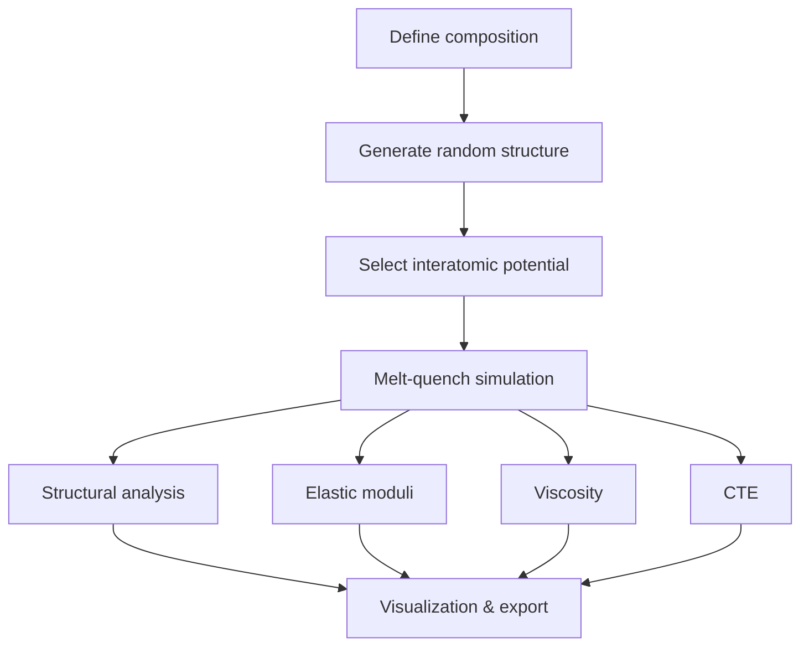

# Tutorial

## Typical Workflow

The standard workflow for studying oxide glasses with `amorphouspy` follows this pipeline:


## Standard Function Patterns

Each step is handled by a Python function, whose output feeds naturally into the next step.

- **Inputs**: They take an [ASE `Atoms`](https://wiki.fysik.dtu.dk/ase/ase/atoms.html) object representing a structure, alongside a pandas DataFrame representing the [Interatomic Potential](theory/potentials/index.md). 
- **Outputs**: They return structured dictionaries, pandas DataFrames, or dedicated namedtuples (like `StructuralAnalysisData`).


## Quick Start

### 1. Generate a glass structure

The first step in any simulation is creating an initial atomic configuration. `amorphouspy` takes a composition dictionary and generates random atom positions in a periodic cubic box with the correct stoichiometry and a physically realistic density.

```python
from amorphouspy import get_structure_dict, get_ase_structure

# Define a soda-lime silicate composition (mol%)
composition = {"SiO2": 75, "Na2O": 15, "CaO": 10}

# Generate structure with ~3000 atoms
# Density is auto-calculated using Fluegel's empirical model
structure_dict = get_structure_dict(composition, target_atoms=3000)

# Convert to ASE Atoms object for visualization and manipulation
atoms = get_ase_structure(structure_dict)

print(f"Generated {len(atoms)} atoms in a {structure_dict['box']:.2f} Å box")
print(f"Formula units: {structure_dict['formula_units']}")
print(f"Element counts: {structure_dict['element_counts']}")
```

### 2. Set up an interatomic potential

Choose from three built-in classical force fields. The potential generator returns a DataFrame containing all LAMMPS configuration lines:

```python
from amorphouspy import generate_potential

# Generate PMMCS potential (broadest element coverage)
potential = generate_potential(structure_dict, potential_type="pmmcs")

# Other options:
# potential = generate_potential(structure_dict, potential_type="bjp")   # CAS glasses
# potential = generate_potential(structure_dict, potential_type="shik")  # Si/Al/B glasses
```

### 3. Run a melt-quench simulation

Transform the random initial structure into a realistic amorphous glass through a heating-equilibration-cooling cycle:

```python
from amorphouspy import melt_quench_simulation

result = melt_quench_simulation(
    structure=atoms,
    potential=potential,
    temperature_high=5000.0,   # Melt at 5000 K
    temperature_low=300.0,     # Quench to 300 K
    heating_rate=1e12,         # K/s (typical for MD)
    cooling_rate=1e12,         # K/s
)

glass_structure = result["structure"]  # Quenched glass
```

> **Tip:** For production runs, use the potential-specific protocols which include optimized multi-stage temperature programs. See [Simulation Workflows](how_to_guides/index.md) for details.

### 4. Load a LAMMPS dump trajectory

Simulation results saved as LAMMPS dump files can be read back with `load_lammps_dump`.
By default the full trajectory is returned as a list of `Atoms` objects.

```python
from amorphouspy import load_lammps_dump

# Full trajectory (list of Atoms)
frames = load_lammps_dump("run.lammpstrj", type_map={1: "O", 2: "Si"})
print(f"{len(frames)} frames loaded")

# Single frame (returns Atoms directly, not a list)
last_frame = load_lammps_dump("run.lammpstrj", type_map={1: "O", 2: "Si"}, frame=-1)

# Slice: frames 100 to 499
subset = load_lammps_dump("run.lammpstrj", type_map={1: "O", 2: "Si"}, start=100, stop=500)

# Every 10th frame from 0 to 999
strided = load_lammps_dump("run.lammpstrj", type_map={1: "O", 2: "Si"}, start=0, stop=1000, step=10)
```

If the dump file was written with `dump_modify element O Si …` (i.e. it contains an `element` column),
you can omit `type_map` entirely:

```python
frames = load_lammps_dump("run.lammpstrj")
```

### 5. Analyze the glass structure

Run a comprehensive structural analysis with a single function call:

```python
from amorphouspy import analyze_structure
from amorphouspy.workflows.structural_analysis import plot_analysis_results_plotly

# Compute all structural properties
data = analyze_structure(glass_structure)

# Inspect results
print(f"Density: {data.density:.3f} g/cm³")
print(f"Network connectivity: {data.network.connectivity:.2f}")
print(f"Qⁿ distribution: {data.network.Qn_distribution}")
print(f"Si coordination: {data.coordination.formers}")

# Generate interactive Plotly visualization
fig = plot_analysis_results_plotly(data)
fig.show()
```

### 6. Compute material properties

```python
from amorphouspy import elastic_simulation

# Calculate elastic constants via stress-strain method
elastic_result = elastic_simulation(
    structure=glass_structure,
    potential=potential,
    temperature=300.0,
    strain=1e-3,
    production_steps=10_000,
)

print(f"Young's modulus: {elastic_result['E']:.1f} GPa")
print(f"Bulk modulus: {elastic_result['B']:.1f} GPa")
print(f"Poisson's ratio: {elastic_result['nu']:.3f}")
```

## Submitting Functions with `executorlib`

The functions in `amorphouspy` are plain Python functions, so you _can_ import and run them directly in your Python interpreter.
However, some of those functions will perform MD simulations with LAMMPS, so they will be long-running, and eventually you may want to submit many of them in parallel.

For this reason, the how-to guides use [executorlib](https://executorlib.readthedocs.io/) to submit these functions to run on high-performance computing resources. Note, however, that you can use the functions in `amorphouspy` with any workflow manager of your choosing.

The basic pattern is:

```python
from executorlib import SingleNodeExecutor

with SingleNodeExecutor() as exe:
    # Submit functions — each returns a future
    atoms_dict_future = exe.submit(
        get_structure_dict,
        composition={"SiO2": 75, "Na2O": 15, "CaO": 10},
        target_atoms=3000,
    )

    # Pass futures as arguments to build a dependency graph
    structure_future = exe.submit(get_ase_structure, atoms_dict=atoms_dict_future)
    potential_future = exe.submit(
        generate_potential,
        atoms_dict=atoms_dict_future,
        potential_type="pmmcs",
    )

    # Downstream tasks automatically wait for their dependencies
    result_future = exe.submit(
        melt_quench_simulation,
        structure=structure_future,
        potential=potential_future,
    )

    # Block until the result is ready
    result = result_future.result()
```

Key points:

- `exe.submit(fn, **kwargs)` returns a `Future` — the function runs asynchronously.
- Passing a `Future` as an argument to another `submit` call creates a dependency — `executorlib` ensures tasks run in the correct order.
- `.result()` blocks until the computation is complete and returns the output.
- Replace `SingleNodeExecutor` with `SlurmClusterExecutor` or `FluxClusterExecutor` to run on HPC clusters — no code changes needed beyond the executor.

See the [How-To Guides](how_to_guides/index.md) for complete examples.


